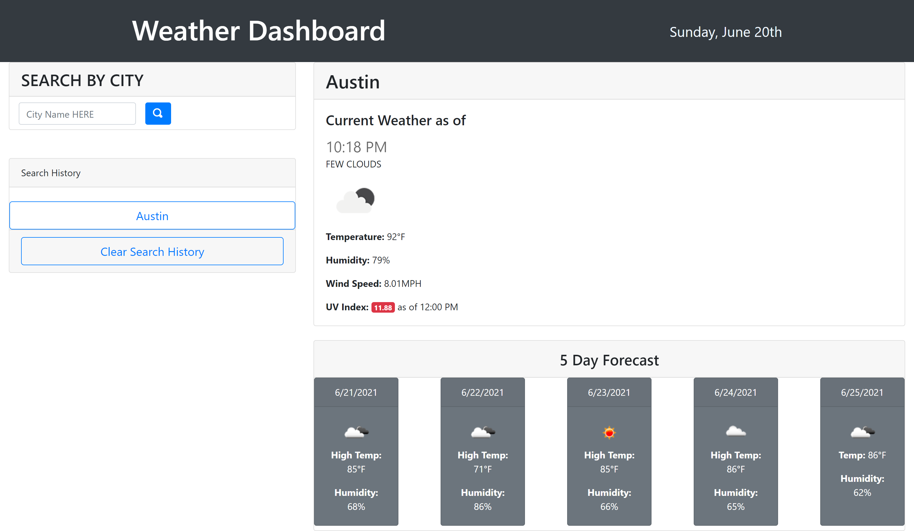

# Weather Dashboard Application

## Following app Renders Current Weather Information and Next 5 Days for selected US City.

### Features:

* For convinience, current date is displayed on the header at all times, while the time will only show when a search is performed;
* By entering a City name in the search field, the app will render current weather information(note: UV Index data is provided only for 12:00 p.m.) and next 5 days high temperatures and humidity;
* The search history is saved and can be used to access those cities weather information by clicking on the buttons;
* For accessibility, the App will render apropriate icons of the weather(ex: cloudy, clear, t-storm, etc);

1. GitHub Repo: https://github.com/hsafiya/Weather-Dashboard
2. Live Page: https://hsafiya.github.io/Weather-Dashboard/

